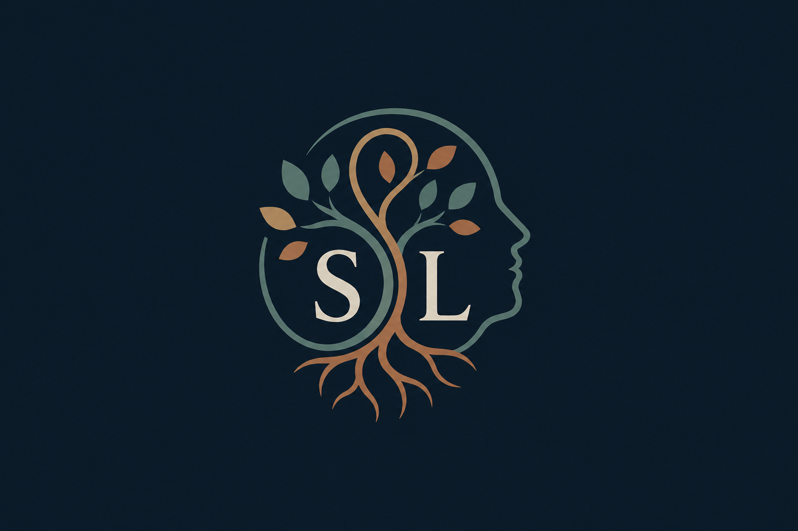

# 🚀 Portafolio Personal — Simón López

<div align="center">

  

  <p><em>"Construyendo experiencias web limpias, escalables y con identidad propia."</em></p>

  <p>
    
    
    
    
  </p>
</div>

---

## 💡 ¿De qué trata este proyecto?
Este repositorio contiene el código fuente de mi **portafolio web personal**, concebido y desarrollado desde cero. Su propósito principal es servir como una carta de presentación digital profesional, destacando mis habilidades técnicas en el desarrollo frontend, mi atención al detalle en el diseño de interfaces (UI/UX) y mi compromiso con los estándares de código limpio (*Clean Code*).

---

## 🛠️ Stack Tecnológico
El proyecto está construido utilizando herramientas modernas y ligeras del ecosistema de desarrollo web actual:

* **Core:** [React](https://react.dev/) — Basado en componentes funcionales reutilizables.
* **Empaquetador:** [Vite](https://vitejs.dev/) — Para un entorno de desarrollo ultrarrápido y optimización de recursos.
* **Estilos:** CSS Moderno — Uso de Variables CSS customizadas, diseño adaptable con Flexbox y CSS Grid, y efectos visuales de cristal (*backdrop-filter*).
* **Control de Versiones:** Git & GitHub — Siguiendo estrictamente el estándar de **Conventional Commits** en el historial de desarrollo.

---

## 📁 Arquitectura y Estructura del Código
Para garantizar un mantenimiento sencillo y una alta escalabilidad, la aplicación sigue una arquitectura modular limpia:

```text
src/
├── assets/          # Recursos gráficos, logotipos personalizados (SLS) e imágenes
├── components/      # Componentes UI desacoplados
│   ├── Navbar.jsx   # Cabecera de navegación fija y semántica
│   ├── Hero.jsx     # Sección principal de bienvenida e impacto visual
│   ├── About.jsx    # Sección biográfica, enfoque profesional y tarjetas de aprendizaje
│   ├── Projects.jsx # Sección dedicada a mostrar proyectos estrella
│   ├── Contact.jsx  # Tarjeta de llamada a la acción (CTA) para conectar
│   └── Footer.jsx   # Pie de página minimalista con iniciales SLS y año dinámico
├── App.jsx          # Componente raíz que organiza el flujo de secciones
└── index.css        # Sistema de diseño global y variables tipográficas
